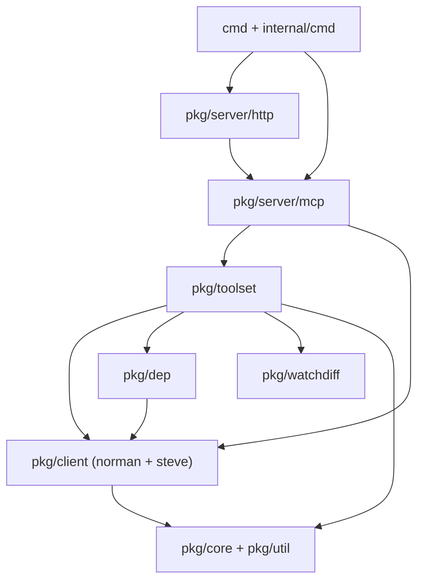
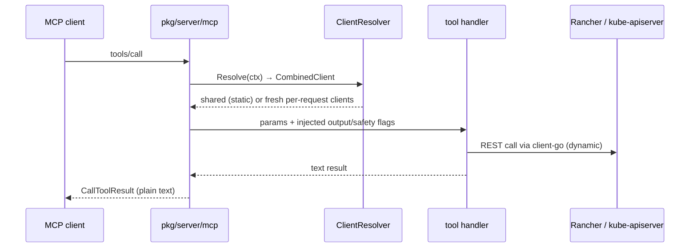

# DESIGN — rancher-mcp-server

Current-state contract for the system integration view. Component detail lives
in subpackage `DESIGN.md` files (linked below); when they conflict, the closer
one wins. Only what exists today — plans and in-progress work do not belong
here.

## What this is

A single static Go binary exposing Rancher and Kubernetes operations as MCP
(Model Context Protocol) tools. No runtime state of its own: every tool call
authenticates to a Rancher server (or kube-apiserver) and returns plain-text
results. Read-only is the default posture; write, destructive, and
container-exec tools are gated at registration time.

## Components

| Component | Owns | Detail |
| --- | --- | --- |
| `cmd/rancher-mcp-server` + `internal/cmd` | CLI entry, config load, stdio vs HTTP selection | — |
| `pkg/server/http` | net/http server: `/healthz`, `/mcp`, `/sse`, `/message`, `/debug/vars`, OAuth discovery | [pkg/server/DESIGN.md](pkg/server/DESIGN.md) |
| `pkg/server/mcp` | MCP assembly, transports, auth resolvers, tool registration, metrics | [pkg/server/DESIGN.md](pkg/server/DESIGN.md) |
| `pkg/client/norman` + `pkg/client/steve` | Rancher v3 API client; Kubernetes access (Rancher proxy + kubeconfig) | [pkg/client/DESIGN.md](pkg/client/DESIGN.md) |
| `pkg/toolset` (+ `kubernetes`, `rancher`, `paramutil`) | Tool framework and the two toolsets | [pkg/toolset/DESIGN.md](pkg/toolset/DESIGN.md) |
| `pkg/dep` | kube-lineage-style dependency graph resolution | — |
| `pkg/watchdiff` | git-style diff engine (stateless printer + caching differ) | — |
| `pkg/core` | config (viper), logging (zerolog, stdio suppression), version | — |
| `pkg/util/url` | Rancher URL normalization (`/v3`, `/k8s/clusters/<id>`) | — |

## Layering

Strict one-way layering, no import cycles:

`pkg/server/http` mounts MCP handlers and never imports toolsets or clients
directly.

## Request flow (one tool call)

## Auth modes (exactly one, enforced in `pkg/core/config` validation)

1. **Static credentials** — `rancher_token` or access/secret key; clients
   built once at startup; works in stdio and HTTP.
2. **Per-request Rancher token** — HTTP only; `Authorization: Bearer` (raw
   `R_token` fallback only when absent); request-scoped clients closed after
   each call.
3. **Rancher OAuth passthrough** — Streamable HTTP `/mcp` only; JWKS-verified
   JWT (RS256, issuer check, scopes `offline_access` + `rancher:mcp`); SSE
   routes not registered.

Kubeconfig cluster access is orthogonal: allowed with mode 1 (warned in HTTP
mode), excluded from modes 2–3. See [pkg/client/DESIGN.md](pkg/client/DESIGN.md).

## External contracts

- MCP via `mark3labs/mcp-go`: stdio; Streamable HTTP (stateless) at `/mcp`;
  SSE at `/sse` + `/message`.
- Rancher: Norman v3 (`/v3`), Kubernetes proxy (`/k8s/clusters/<clusterID>`),
  OAuth JWKS + `/.well-known/oauth-protected-resource`.
- Config: single YAML via `--config` (viper precedence: flags >
  `RANCHER_MCP_`-prefixed env > file > defaults); no auto-discovery.
- Ops: `/healthz` (JSON capability status), `/debug/vars` (curated expvar).

## Hard invariants

- Auth-mode exclusivity is a config-level invariant.
- stdio mode: logs fully suppressed (protocol channel); modes 2–3 rejected in
  stdio.
- Secret masking enforced server-side; `showSensitiveData` only via global
  flag.
- Read-only default; write/destructive/container-exec tools opt-in at
  registration.
- Tool results are plain text only (`NewTextResult`).

## Release / packaging

Single binary, CGO disabled. `npm/rancher-mcp-server` meta package spawns the
platform binary resolved from `optionalDependencies`; goreleaser builds linux
amd64/arm64 with multi-arch images at `ghcr.io/futuretea/rancher-mcp-server`;
Docker runtime is `wolfi-base` non-root. `third-party-projects/rancher-ai-mcp/`
is a separate-module reference project, not part of this build;
`enhancements/` holds shipped-feature design records.
